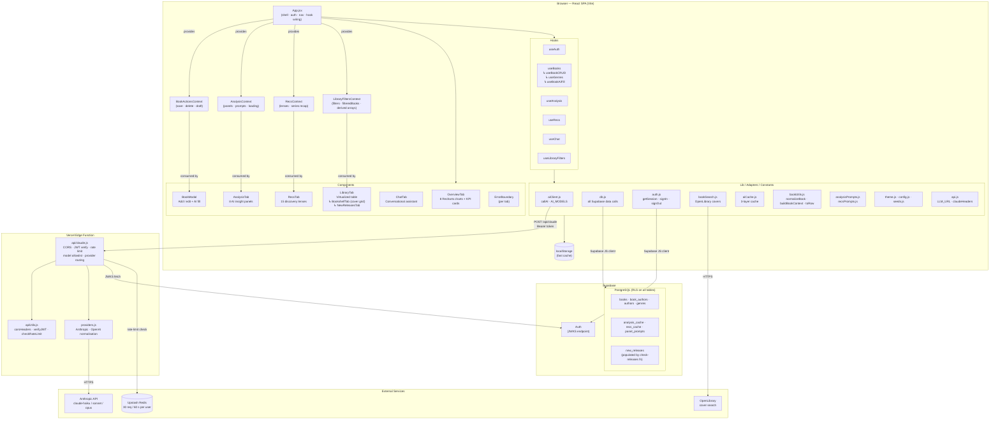
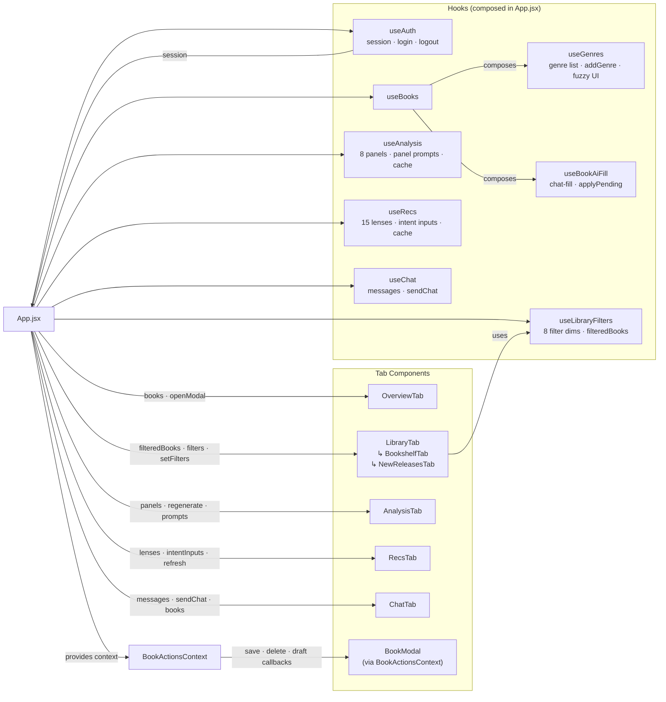
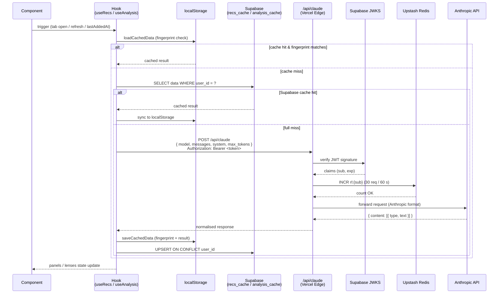

# Architecture

Three diagrams covering different levels of the system.

---

## 1. System Layers

The four runtime tiers and how they connect.

---

## 2. Hook & Component Wiring

How `App.jsx` connects hooks to components.

---

## 3. AI Request & Cache Data Flow

What happens when a hook needs fresh AI output (e.g. recommendations).

> **Fingerprint** — cache key derived from `books.map(b => "${b.id}|${b.title}|${b.year}|${b.genre}").join(",")`.
> Any add, edit, or delete changes the fingerprint and invalidates both caches.
>
> **Sequential pacing** — `useAnalysis` calls the edge function once per panel with an 8-second inter-request delay (`INTER_REQUEST_DELAY_MS`) to respect Anthropic rate limits.
